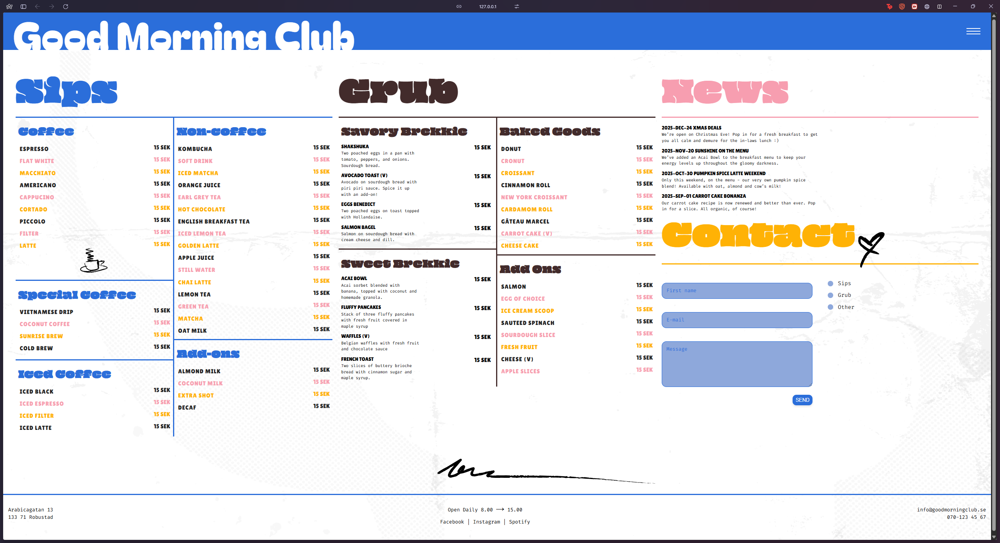
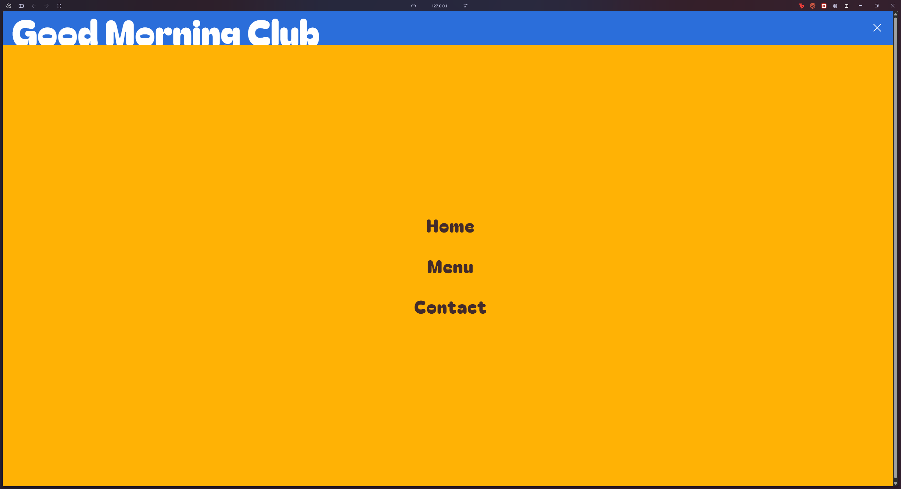
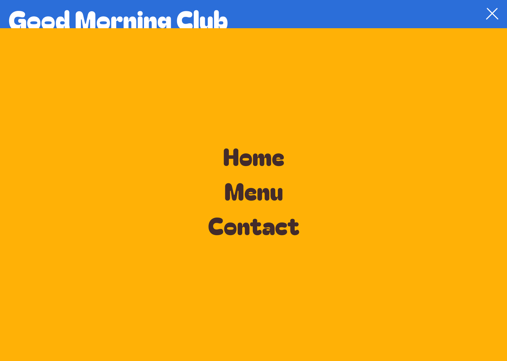
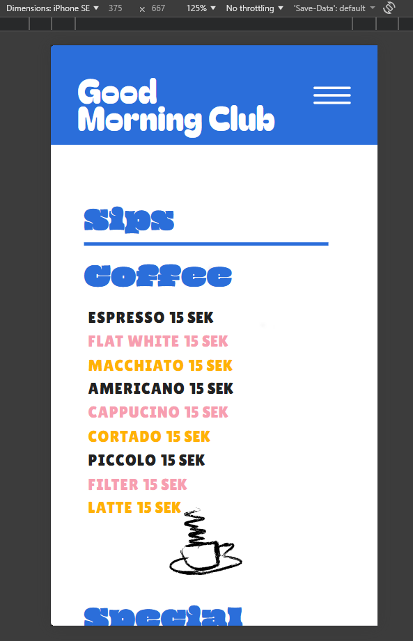

# Good Morning Club - Breakfast & Coffee

This project is a responsive breakfast and coffee menu website built as a school assignment. The design was provided as part of the assignment brief. The site is built with HTML, SCSS/CSS, and JavaScript, and features a modern, mobile-friendly layout with a custom overlay menu, styled menu lists, and a contact form.

## Features

- Responsive design for desktop and mobile
- Overlay navigation menu
- Menu sections for drinks (Sips), food (Grub), and news
- Custom fonts and color scheme
- Contact form with styled inputs

## Getting Started

Open `index.html` in your browser to view the site. All styles are in the `css/` folder and images in the `img/` folder.

---

## Final Result

_Note: Screenshots above represent the final desktop view on a 2560x1440 screen, zoomed out to 80% to capture the full design in one image._

## The Given Design

Below is the original design mockup provided for this assignment:

## Responsiveness

Responsiveness is achieved using:

- Flexbox and CSS Grid for layout
- Media queries to adapt the design for different screen sizes
- Use of rem and percentage units for flexible sizing
- The menu transforms into an overlay on mobile and is optimized for touch

> **Note:** Responsive design is very challenging for this project. It does not look great on mobile or iPad yet, but this is a work in progress.

## Lighthouse Report (Jan 2026)

After optimizing images, CSS, and JavaScript, the site achieved the following Lighthouse results:

| Category       | Score |
| -------------- | ----- |
| Performance    | 92    |
| Accessibility  | 94    |
| Best Practices | 96    |
| SEO            | 91    |

**Performance Metrics:**

- First Contentful Paint: 0.7s
- Largest Contentful Paint: 1.5s
- Total Blocking Time: 0ms
- Speed Index: 0.7s
- Cumulative Layout Shift: 0.118

---
